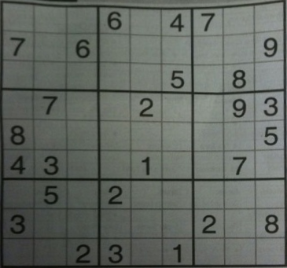
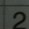

# cv-sudoku
Sudoku solver using rudimentary computer vision and optical character recognition techniques. 
OpenCV learning project.

## Process
An image is first captured via the user's default desktop camera. 
The image is then taken into the script after resources are released for **preprocessing**. 

The **preprocessing** step involves converting the raw image to grayscale, applying a low-pass filter
(in this case, a `Gaussian blur`), and then applying adaptive thresholding to make the image easier to analyze.

The next phase attempts to identify the corners of the largest contour in the image and perform a **perspective warp** 
on the image. This is done by generating a kernel of ones (except the matrix corners, which are 0), performing a dilation
morphological operation, finding the contours using the kernel, and then reverse-ordering the contours based on area. Filtering each 
contour based on length and size determines the largest one. The image is then downsampled and a top-down view 
of only the board is obtained.

The downsampled image is then **partitioned**. The warped image is resized to fit a square and is divided into 9 X 9 images, 
each of which represent a cell in the board (some samples below).

 
 

Using `PyTesseract`, each of the 81 split images is preprocessed and then analyzed via number whitelisting.
Identified numbers are put into an `ndarray` with shape (9, 9). Once all images have been passed, the numpy
array is converted into a Python list. The `solver` attempts to determine a solution via backtracking, which is 
printed to console.

